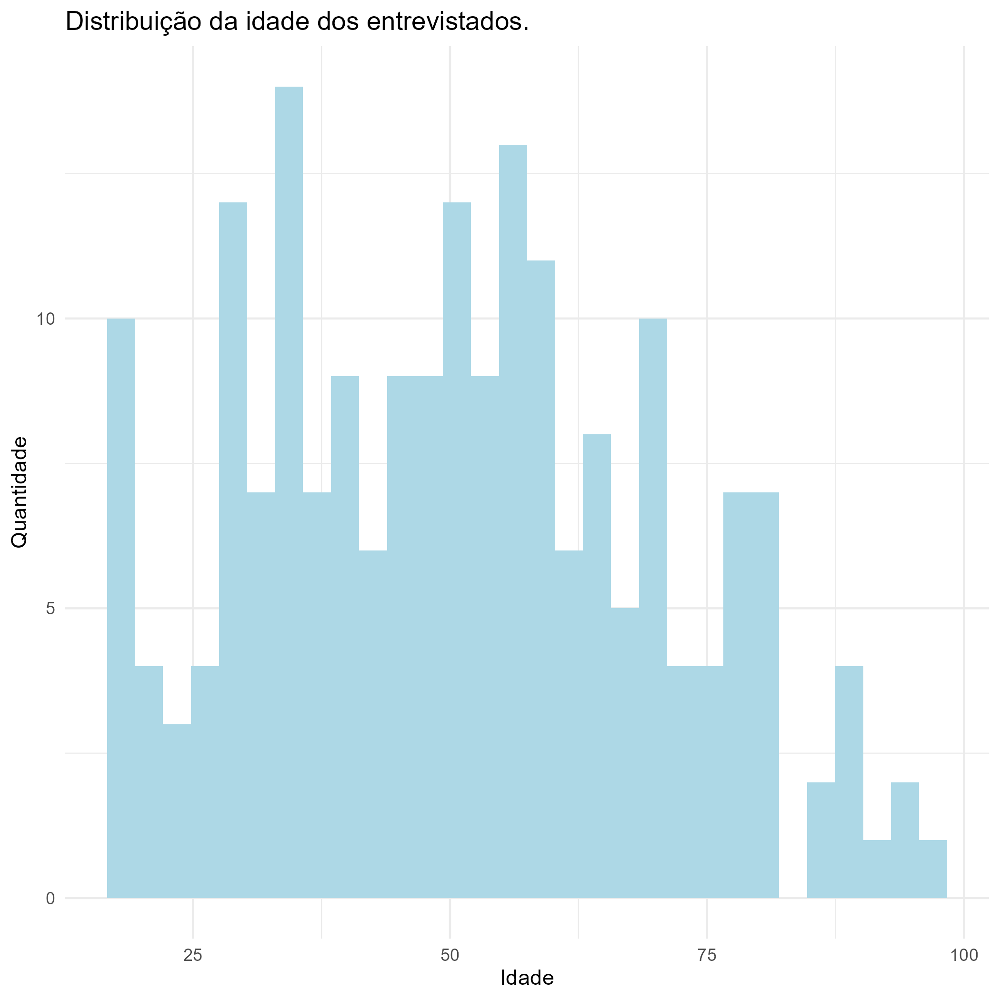
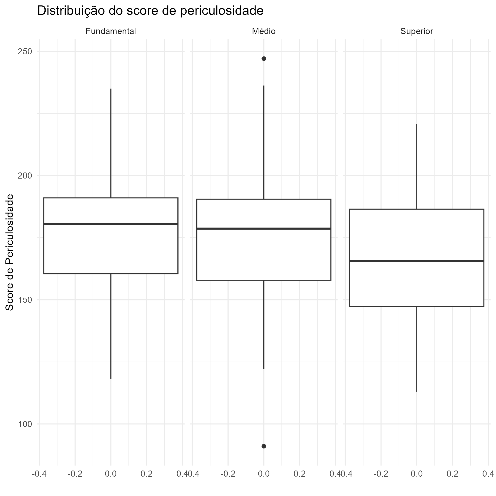
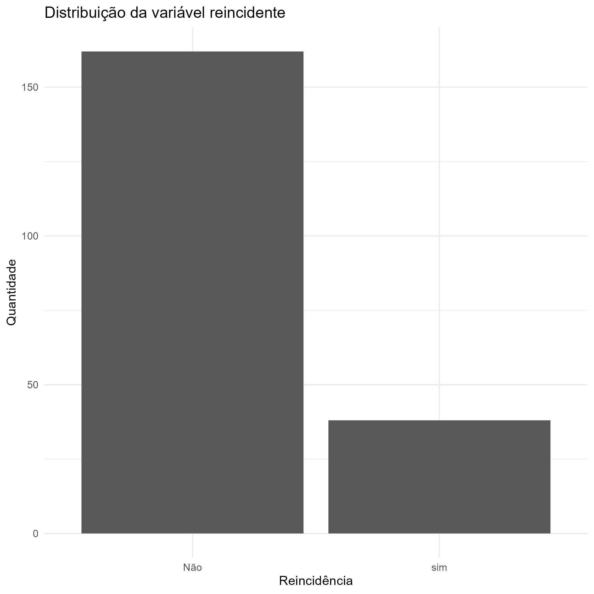

# AnaliseExploratoria

Repositório criado para a disciplina de Prática 2.

# Invetigação inicial
Ao realizar uma breve análise sobre o conjunto de dados, podemos observar que:
\
\
A idade dos presidiários se concentra em torno dos 50 anos

\
O boxplot revela que metade dos presidiários cumprem penas inferiores que a 60 meses, ao verificar a mediana do tempo de permanência.

\
A seguir podemos verificar que o score de periculosidade tende a diminuir levemente conforme o nível de instrução aumenta.

\
O plot abaixo evidencia que o número de presidiários não reincidentes é 4x maior que os reincidentes.

# Análise Exploratória
Pudemos verificar que o **score de periculosidade** apresenta uma média e mediana de **174 e 177 meses**, respectivamente e aproximadamente.
\
[CONTINUAR]